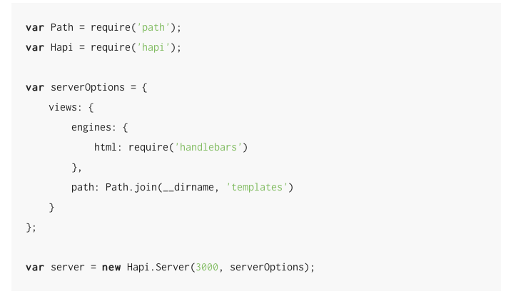
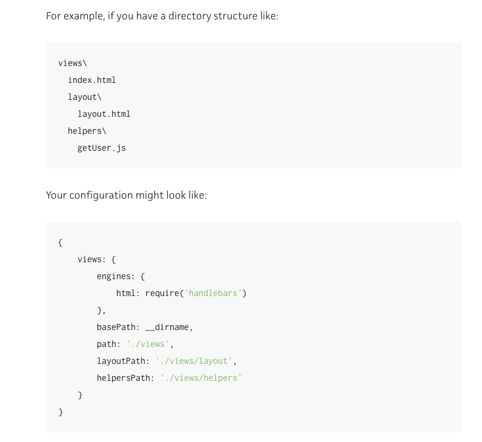
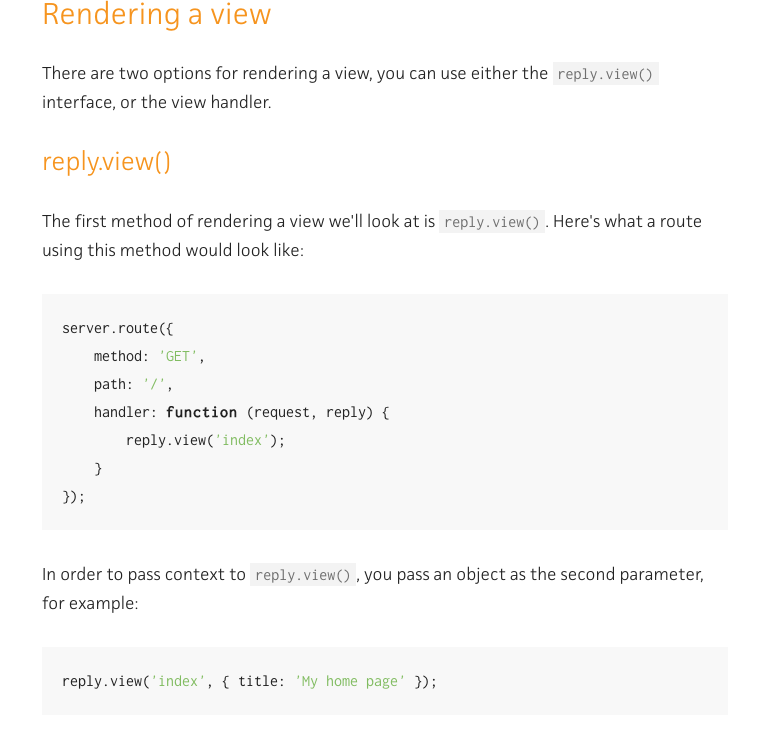
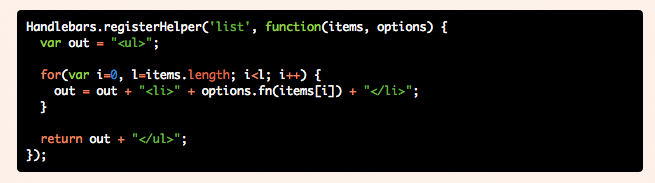
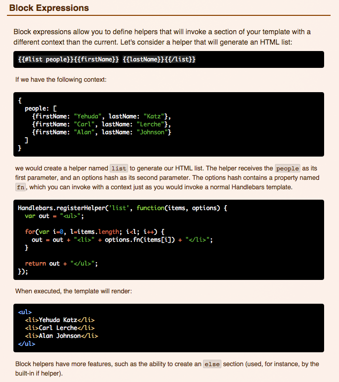

#Handlebars for Beginners integrated with hapiJs

More than often as an upcoming developer I have come across several tutorials for various different topics, and more than
often because I am/was a beginner
understanding those tutorials were challenging, mainly because most of them are written with with the premiss that you
are already a developer and
understand a lot of the topics in the tutorials.
However that is not always the case. On one hand this is good because it forces you to do more research and in turn,
become a more complete
and seasoned developer. Sometimes this could lead to you eventually knowing more than an already trained developer,
because you always have to go that extra mile.
But you dont always want to or have time to spend searching and searching for the simple answers, and just as with
basically everything, there are good ways and bad ways at doing things.

**This is why I have taken the time to write this short and simple tutorial for handlebars and hapi.**

Hopefully you will find this useful at some point.

###What is handlebars?

[Handlebars](http://handlebarsjs.com/) is a minimal templating system that uses javascript. Templates allow you to
use a data source to customize your webpage (example: insert search results in specific places of your page) and render it in your **HTML**.

For a more complete definition of what templates are, go to: http://en.wikipedia.org/wiki/Web_template_system

Handlebars is a logic-*less* (little to no logic embedded in the templates) templating engine.
And this is how we want it. Having javascript logic embedded in our html is not good practice and makes code hard to maintain in the long-run,
 not to mention hard to read when things get complex. As a means to circumvent this, handlebars has
*built-in helper functions* and allows you to define your own *custom helper functions*.

###Getting started with hapi and handlerbars

>I'm not going to go into much detail here. There is clear instruction
on how to implement handlebars in your hapi application at: http://hapijs.com/tutorials/views

First of all you will need to set the paths to your templates (i.e files and directories). In your main server file,
you will have to use the *options* or *config* object and in that object define the paths and require your templating engine.

But you are most likely going to use a [custom helper](http://javascriptissexy.com/handlebars-js-tutorial-learn-everything-about-handlebars-js-javascript-templating/#Handlebarsjs_Custom_Helpers) functions
in your code so you would want to complete your set-up in your server and have something look more like this:

Note: **The structure of your directory layout is important!**

>Once you have that done you can move on to passing the data from your server to your templating engine.

The nest step involves rendering views in hapi. This is accomplished in the simplest form by writting
*reply.view('templateName', { placeholder: data })*

See [hapi.views](http://hapijs.com/tutorials/views#rendering-a-view) for a more complete example

>This is pretty much what you need to get started.

####However our data is not always rendered in the form we would want it to be, and we need to perfom mainpulations so
that the user receives readable results and not some gibberish.

>This is where your custom helper functions or built-in helper functions come into play with handlebars.

####Built-in helper functions

Built-in helper functions are called in your HTML template. They are conditionals and loops.
You call a built-in helper by writing *{{#functionName data}}*, where "#" defines the start of a block and
*{{/functionName}}* defines the end of the block. This will apply *functionName* to the data passed into this block.

####Custom helper functions

Using the directory structure defined above in the set-up views for hapi, the logic behind it is that in your *template* directory, *helpers* directory, *getUser* file
you will have to define a javascript function which will then manipulate your data and output exactly what it is you want to output.

To be able to use your helper function you will have to register it.

This is accomplished by writing `Hanldebars.registerHelper('nameOfHelper', function(data)){}`

Now that you know what a **block expression** is and how to **register** and call a **helper function**, lets have a look at an
example where all three paths are implemented.

Here we're calling the *list* function on the object *people* and looking for the
*firstName* and *lastName* values which will then be rendered as a list.

---

>This short overview should get you started on using handlebars with hapi.

---

###Resources:
- http://en.wikipedia.org/wiki/Web_template_system
- http://handlebarsjs.com/
- http://javascriptissexy.com/handlebars-js-tutorial-learn-everything-about-handlebars-js-javascript-templating/
- http://hapijs.com/tutorials/views
- https://github.com/ericf/express-handlebars/issues/50
- http://code.tutsplus.com/tutorials/best-practices-when-working-with-javascript-templates--net-28364
